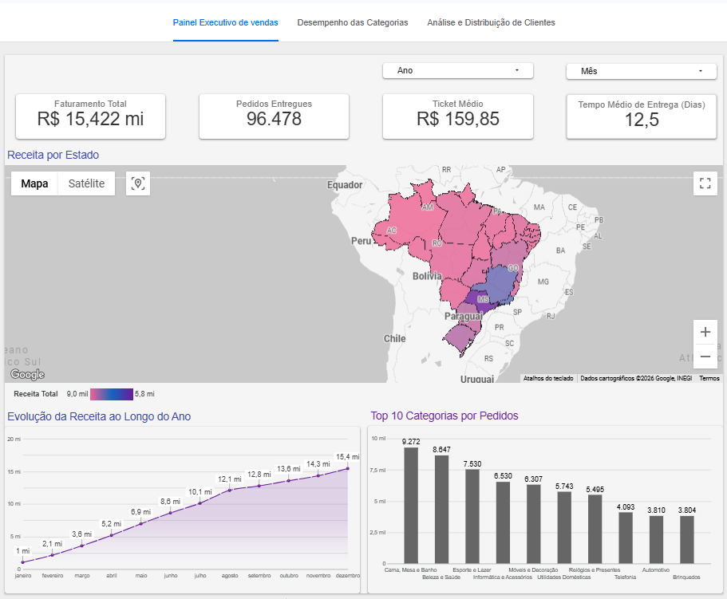
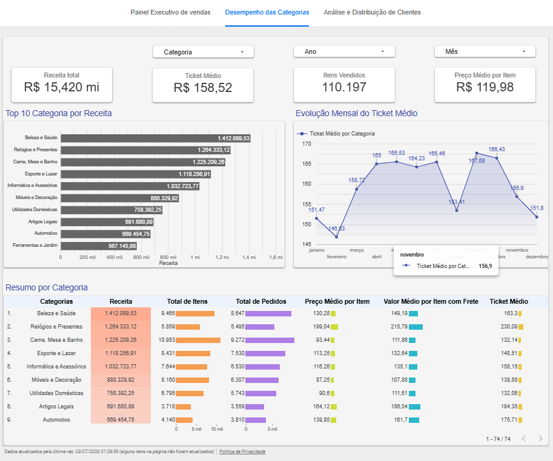
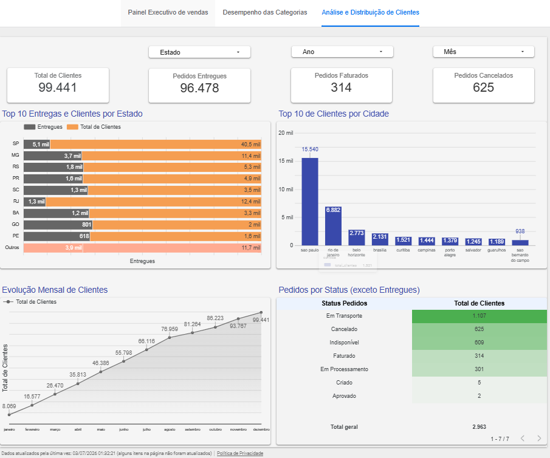

# 📊 Olist Sales Analytics | BigQuery & Looker Studio

## 📌 Sobre o Projeto

Projeto de análise de dados **end-to-end** utilizando o dataset público da **Olist**.

Os dados foram importados para o **Google BigQuery**, transformados através de consultas SQL utilizando **CTEs, Window Functions e Joins**, consolidados em **Views Analíticas** e posteriormente conectados ao **Looker Studio** para construção de dashboards interativos.

O objetivo do projeto é demonstrar um fluxo completo de Business Intelligence, desde a modelagem dos dados até a geração de insights para apoio à tomada de decisão.

---

## 🚀 Tecnologias

- Google BigQuery
- SQL
- Looker Studio
- Git
- GitHub

---

## 🎯 Objetivos

- Construir um pipeline analítico utilizando BigQuery
- Desenvolver consultas SQL otimizadas
- Criar Views Analíticas para consumo dos dashboards
- Desenvolver dashboards executivos no Looker Studio
- Gerar indicadores para suporte à tomada de decisão

---

## 🏗️ Arquitetura do Pipeline

```text
Dataset Olist (CSV)
        │
        ▼
Google BigQuery
(Tabelas Raw)
        │
        ▼
Transformações SQL
(CTEs • Window Functions • Joins)
        │
        ▼
Camada Analítica
(5 Views)
        │
        ▼
Looker Studio
(Dashboard Executivo • Categorias • Clientes)
```

---

## 🗂️ Modelo Analítico

| View | Descrição | SQL |
|------|-----------|-----|
| `vw_receita_por_estado` | Receita, Ticket Médio e Prazo Médio de Entrega | [Ver SQL](painel/Sql/receita_por_estado.sql) |
| `vw_receita_mensal` | Receita Mensal, Crescimento MoM e Acumulado Anual | [Ver SQL](painel/Sql/receita_mensal.sql) |
| `vw_top_categorias` | Receita por Categoria e Preço Médio | [Ver SQL](painel/Sql/top_categorias.sql) |
| `vw_pedidos_status` | Evolução dos Status dos Pedidos | [Ver SQL](painel/Sql/status_pedido.sql) |
| `vw_clientes_regiao` | Distribuição de Clientes por Cidade e Estado | [Ver SQL](painel/Sql/clientes_regiao.sql) |

---

## 📈 Dashboards

### 📊 Painel Executivo

- Receita Total
- Ticket Médio
- Pedidos Entregues
- Prazo Médio de Entrega
- Receita por Estado
- Receita Mensal
- Top 10 Categorias



---

### 📦 Desempenho das Categorias

- Receita por Categoria
- Ticket Médio
- Itens Vendidos
- Preço Médio
- Evolução Mensal
- Ranking das Categorias



---

### 👥 Análise de Clientes

- Total de Clientes
- Pedidos Entregues
- Pedidos Cancelados
- Clientes por Estado
- Clientes por Cidade
- Evolução Mensal
- Status dos Pedidos



---

## 💡 Principais Insights

O projeto permite identificar, entre outros pontos:

- Estados com maior participação na receita.
- Evolução mensal do faturamento.
- Categorias com maior volume de vendas.
- Distribuição geográfica dos clientes.
- Relação entre ticket médio e categorias.
- Distribuição dos pedidos por status.
- Indicadores executivos para acompanhamento das vendas.

---

## 📁 Estrutura do Projeto

```text
📦 olist-analytics-bigquery-looker
│
├── painel
│   ├── Sql
│   └── imagens
│
├── README.md
└── documentação
```

---

## 🔗 Dashboard

👉 **Acesse o Dashboard no Looker Studio**

(https://datastudio.google.com/reporting/072729d8-07b0-4b29-b17b-4af1e3a869f7)

---

## 📚 Competências Demonstradas

- SQL Avançado
- Google BigQuery
- Looker Studio
- Modelagem Analítica
- Business Intelligence
- Visualização de Dados
- Git e GitHub
- Construção de Dashboards Executivos

---

## 🚀 Próximas Evoluções

- [x] Modelagem Analítica
- [x] Views SQL
- [x] Dashboard Executivo
- [x] Dashboard Comercial
- [x] Dashboard de Clientes
- [ ] Automatização do Pipeline
- [ ] dbt
- [ ] Integração com Python
